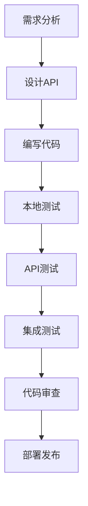

# 开发指南

## 概述

本文档为持久有效激活验证服务的开发指南，包含环境搭建、代码结构、开发流程、调试技巧等内容。

## 开发环境搭建

### 系统要求
- **Node.js**: >= 14.0.0
- **npm**: >= 6.0.0
- **操作系统**: Windows 10+, macOS 10.15+, Ubuntu 18.04+

### 快速开始

#### 1. 项目初始化
```bash
# 克隆或下载项目
cd activation-service-persistent

# 安装依赖
npm install

# 配置环境变量（可选）
copy .env.example .env

# 初始化数据库
npm run init-db

# 启动开发服务器
npm run dev
```

#### 2. 验证安装
```bash
# 检查服务状态
curl http://localhost:3000/health

# 测试激活码验证
curl -X POST http://localhost:3000/api/verify \
  -H "Content-Type: application/json" \
  -d '{
    "code": "DEMO_001",
    "product_key": "doubao_plugin"
  }'
```

## 项目结构详解

```
activation-service-persistent/
├── src/                        # 源代码目录
│   ├── app.js                  # 应用入口文件
│   └── database/
│       └── init.sql           # 数据库初始化脚本
├── data/                       # 数据目录
│   └── activation.db          # SQLite数据库文件
├── docs/                       # 文档目录
│   ├── api-documentation.md   # API接口文档
│   ├── development-guide.md   # 开发指南
│   └── technical-design.md    # 技术设计文档
├── .env.example                # 环境变量模板
├── package.json               # 项目配置
└── README.md                  # 项目说明
```

### 核心文件说明

#### `src/app.js` - 应用入口
- Express应用配置
- 中间件设置
- 路由定义
- 错误处理
- 服务启动逻辑

#### `src/database/init.sql` - 数据库初始化
- 表结构定义
- 索引创建
- 默认数据插入

## 开发工作流

### 1. 功能开发流程



### 2. 代码开发规范

#### JavaScript代码规范
```javascript
// 使用const/let，避免var
const express = require('express');
let dbConnection = null;

// 函数命名使用驼峰命名法
async function verifyActivationCode() {}
function createActivationCode() {}

// 类命名使用帕斯卡命名法
class ActivationService {}
class DatabaseManager {}

// 常量使用大写下划线
const DEFAULT_VERIFY_INTERVAL = 24;
const MAX_RETRY_ATTEMPTS = 3;

// 错误处理模式
try {
  const result = await someOperation();
  return { success: true, data: result };
} catch (error) {
  console.error('操作失败:', error);
  return { success: false, message: '操作失败' };
}
```

#### API设计规范
```javascript
// 统一的响应格式
const successResponse = (data, message = '操作成功') => ({
  success: true,
  data: data,
  message: message,
  timestamp: new Date().toISOString()
});

const errorResponse = (message, statusCode = 500) => ({
  success: false,
  message: message,
  timestamp: new Date().toISOString()
});

// 路由处理模式
app.post('/api/verify', async (req, res) => {
  try {
    // 1. 参数验证
    const { code, product_key } = req.body;
    if (!code || !product_key) {
      return res.status(400).json(errorResponse('参数不能为空'));
    }

    // 2. 业务逻辑
    const result = await verifyCode(code, product_key);

    // 3. 返回结果
    res.json(successResponse(result));

  } catch (error) {
    console.error('验证失败:', error);
    res.status(500).json(errorResponse('服务器内部错误'));
  }
});
```

### 3. 数据库操作规范

#### 数据库连接管理
```javascript
const sqlite3 = require('sqlite3').verbose();

class DatabaseManager {
  constructor(dbPath) {
    this.dbPath = dbPath;
    this.db = null;
  }

  async connect() {
    return new Promise((resolve, reject) => {
      this.db = new sqlite3.Database(this.dbPath, (err) => {
        if (err) {
          reject(err);
        } else {
          console.log('数据库连接成功');
          resolve();
        }
      });
    });
  }

  async close() {
    return new Promise((resolve) => {
      if (this.db) {
        this.db.close((err) => {
          if (err) {
            console.error('数据库关闭错误:', err);
          } else {
            console.log('数据库连接已关闭');
          }
          resolve();
        });
      } else {
        resolve();
      }
    });
  }

  // 通用查询方法
  async query(sql, params = []) {
    return new Promise((resolve, reject) => {
      this.db.all(sql, params, (err, rows) => {
        if (err) {
          reject(err);
        } else {
          resolve(rows);
        }
      });
    });
  }

  // 通用单条查询
  async get(sql, params = []) {
    return new Promise((resolve, reject) => {
      this.db.get(sql, params, (err, row) => {
        if (err) {
          reject(err);
        } else {
          resolve(row);
        }
      });
    });
  }

  // 通用执行方法
  async run(sql, params = []) {
    return new Promise((resolve, reject) => {
      this.db.run(sql, params, function(err) {
        if (err) {
          reject(err);
        } else {
          resolve({ id: this.lastID, changes: this.changes });
        }
      });
    });
  }
}
```

#### 业务数据操作
```javascript
class ActivationService {
  constructor(db) {
    this.db = db;
  }

  async verifyActivationCode(code, productKey) {
    const sql = `
      SELECT * FROM activation_codes
      WHERE code = ? AND product_key = ? AND status = 'active'
    `;

    const activation = await this.db.get(sql, [code, productKey]);

    if (!activation) {
      return { success: false, message: '激活码不存在或产品不匹配' };
    }

    // 计算下次验证时间
    const now = new Date();
    const nextVerifyTime = new Date(
      now.getTime() + activation.verify_interval_hours * 60 * 60 * 1000
    );

    // 记录验证日志
    await this.logVerification(code, 'success');

    return {
      success: true,
      data: {
        status: 'active',
        next_verify_at: nextVerifyTime.toISOString(),
        verify_interval_hours: activation.verify_interval_hours,
        activated_at: now.toISOString()
      }
    };
  }

  async logVerification(code, result, deviceId = null) {
    const sql = `
      INSERT INTO verification_logs (code, device_id, result)
      VALUES (?, ?, ?)
    `;

    await this.db.run(sql, [code, deviceId, result]);
  }

  async getStats() {
    const sql = `
      SELECT
        (SELECT COUNT(*) FROM activation_codes WHERE status = 'active') as active_codes,
        (SELECT COUNT(*) FROM verification_logs WHERE date(timestamp) = date('now')) as today_verifications,
        (SELECT COUNT(*) FROM verification_logs WHERE date(timestamp) = date('now') AND result = 'success') as today_success
    `;

    return await this.db.get(sql);
  }
}
```

## 调试和测试

### 1. 开发环境调试

#### 启动开发模式
```bash
# 使用nodemon自动重启
npm run dev

# 或者使用node-inspector调试
node --inspect src/app.js
```

#### 日志配置
```javascript
// 开发环境详细日志
if (process.env.NODE_ENV === 'development') {
  app.use((req, res, next) => {
    console.log(`[${new Date().toISOString()}] ${req.method} ${req.url}`);
    console.log('Headers:', req.headers);
    console.log('Body:', req.body);
    next();
  });
}

// Morgan HTTP请求日志
const morgan = require('morgan');
app.use(morgan('dev')); // 开发环境简洁格式
```

#### 调试中间件
```javascript
// 请求调试中间件
app.use('/debug', (req, res) => {
  res.json({
    timestamp: new Date().toISOString(),
    method: req.method,
    url: req.url,
    headers: req.headers,
    body: req.body,
    query: req.query,
    params: req.params
  });
});

// 数据库调试接口
app.get('/debug/database', async (req, res) => {
  try {
    const stats = await activationService.getStats();
    const codes = await db.query('SELECT * FROM activation_codes LIMIT 10');
    const logs = await db.query('SELECT * FROM verification_logs ORDER BY timestamp DESC LIMIT 10');

    res.json({
      stats: stats,
      codes: codes,
      recent_logs: logs
    });
  } catch (error) {
    res.status(500).json({ error: error.message });
  }
});
```

### 2. 单元测试

#### 测试框架配置
```json
// package.json
{
  "scripts": {
    "test": "jest",
    "test:watch": "jest --watch",
    "test:coverage": "jest --coverage"
  },
  "devDependencies": {
    "jest": "^29.7.0",
    "supertest": "^6.3.3"
  }
}
```

#### 测试用例示例
```javascript
// tests/activation.test.js
const request = require('supertest');
const app = require('../src/app');

describe('激活验证API测试', () => {
  describe('POST /api/verify', () => {
    test('有效激活码验证成功', async () => {
      const response = await request(app)
        .post('/api/verify')
        .send({
          code: 'DEMO_001',
          product_key: 'doubao_plugin',
          device_id: 'test_device_123'
        });

      expect(response.status).toBe(200);
      expect(response.body.success).toBe(true);
      expect(response.body.data).toHaveProperty('next_verify_at');
      expect(response.body.data).toHaveProperty('verify_interval_hours');
    });

    test('无效激活码验证失败', async () => {
      const response = await request(app)
        .post('/api/verify')
        .send({
          code: 'INVALID_CODE',
          product_key: 'doubao_plugin'
        });

      expect(response.status).toBe(200);
      expect(response.body.success).toBe(false);
      expect(response.body.message).toContain('不存在或产品不匹配');
    });

    test('缺少参数返回400错误', async () => {
      const response = await request(app)
        .post('/api/verify')
        .send({
          code: 'DEMO_001'
          // 缺少 product_key
        });

      expect(response.status).toBe(400);
      expect(response.body.success).toBe(false);
    });
  });

  describe('GET /health', () => {
    test('健康检查返回正确状态', async () => {
      const response = await request(app)
        .get('/health');

      expect(response.status).toBe(200);
      expect(response.body.status).toBe('ok');
      expect(response.body.service).toBe('activation-service-simple');
    });
  });
});
```

### 3. API测试

#### 使用Postman测试
```javascript
// Postman集合示例
{
  "info": {
    "name": "激活验证服务测试",
    "schema": "https://schema.getpostman.com/json/collection/v2.1.0/collection.json"
  },
  "item": [
    {
      "name": "健康检查",
      "request": {
        "method": "GET",
        "url": "http://localhost:3000/health"
      }
    },
    {
      "name": "激活码验证 - 成功",
      "request": {
        "method": "POST",
        "header": [
          {
            "key": "Content-Type",
            "value": "application/json"
          }
        ],
        "body": {
          "mode": "raw",
          "raw": "{\n  \"code\": \"DEMO_001\",\n  \"product_key\": \"doubao_plugin\",\n  \"device_id\": \"test_device_123\"\n}"
        },
        "url": "http://localhost:3000/api/verify"
      }
    },
    {
      "name": "激活码验证 - 失败",
      "request": {
        "method": "POST",
        "header": [
          {
            "key": "Content-Type",
            "value": "application/json"
          }
        ],
        "body": {
          "mode": "raw",
          "raw": "{\n  \"code\": \"WRONG_CODE\",\n  \"product_key\": \"doubao_plugin\"\n}"
        },
        "url": "http://localhost:3000/api/verify"
      }
    }
  ]
}
```

#### 自动化测试脚本
```javascript
// tests/api-test.js
const axios = require('axios');

const BASE_URL = 'http://localhost:3000';

class APITester {
  constructor(baseUrl) {
    this.baseUrl = baseUrl;
  }

  async testHealth() {
    try {
      const response = await axios.get(`${this.baseUrl}/health`);
      console.log('✅ 健康检查通过:', response.data);
      return true;
    } catch (error) {
      console.error('❌ 健康检查失败:', error.message);
      return false;
    }
  }

  async testActivation(code, productKey, expectedResult = true) {
    try {
      const response = await axios.post(`${this.baseUrl}/api/verify`, {
        code: code,
        product_key: productKey,
        device_id: 'test_device_' + Date.now()
      });

      const success = response.data.success === expectedResult;
      if (success) {
        console.log(`✅ 激活码 ${code} 测试通过:`, response.data.message);
      } else {
        console.log(`❌ 激活码 ${code} 测试失败: 期望 ${expectedResult}, 实际 ${response.data.success}`);
      }
      return success;
    } catch (error) {
      console.error(`❌ 激活码 ${code} 测试异常:`, error.message);
      return false;
    }
  }

  async runAllTests() {
    console.log('🚀 开始API测试...\n');

    const tests = [
      () => this.testHealth(),
      () => this.testActivation('DEMO_001', 'doubao_plugin', true),
      () => this.testActivation('DEMO_002', 'doubao_plugin', true),
      () => this.testActivation('WRONG_CODE', 'doubao_plugin', false),
      () => this.testActivation('DEMO_001', 'wrong_product', false)
    ];

    let passed = 0;
    let total = tests.length;

    for (const test of tests) {
      if (await test()) {
        passed++;
      }
      console.log(''); // 空行分隔
    }

    console.log(`📊 测试完成: ${passed}/${total} 通过`);
    return passed === total;
  }
}

// 运行测试
const tester = new APITester(BASE_URL);
tester.runAllTests().then(success => {
  process.exit(success ? 0 : 1);
});
```

## 部署和运维

### 1. 本地部署

#### 环境配置
```bash
# .env.production
NODE_ENV=production
PORT=3000
```

#### 启动脚本
```bash
#!/bin/bash
# deploy.sh

echo "🚀 开始部署激活验证服务..."

# 检查Node.js版本
node_version=$(node -v | cut -d'v' -f2)
required_version="14.0.0"

if [ "$(printf '%s\n' "$required_version" "$node_version" | sort -V | head -n1)" = "$required_version" ]; then
    echo "✅ Node.js版本检查通过: $node_version"
else
    echo "❌ Node.js版本过低，需要 >= $required_version，当前版本: $node_version"
    exit 1
fi

# 安装依赖
echo "📦 安装依赖..."
npm ci --production

# 检查端口是否被占用
if lsof -Pi :3000 -sTCP:LISTEN -t >/dev/null ; then
    echo "❌ 端口3000已被占用"
    exit 1
fi

# 启动服务
echo "🎯 启动服务..."
npm start

echo "✅ 部署完成"
```

### 2. 生产环境部署

#### PM2配置
```javascript
// ecosystem.config.js
module.exports = {
  apps: [{
    name: 'activation-service',
    script: 'src/app.js',
    instances: 'max',
    exec_mode: 'cluster',
    env: {
      NODE_ENV: 'production',
      PORT: 3000
    },
    error_file: './logs/err.log',
    out_file: './logs/out.log',
    log_file: './logs/combined.log',
    time: true,
    max_memory_restart: '1G',
    node_args: '--max-old-space-size=1024',
    watch: false,
    ignore_watch: ['node_modules', 'logs', 'data'],
    restart_delay: 4000,
    max_restarts: 10,
    min_uptime: '10s'
  }]
};
```

#### 部署命令
```bash
# 安装PM2
npm install -g pm2

# 启动应用
pm2 start ecosystem.config.js

# 查看状态
pm2 status

# 查看日志
pm2 logs activation-service

# 重启应用
pm2 restart activation-service

# 停止应用
pm2 stop activation-service

# 保存PM2配置
pm2 save
pm2 startup
```

### 3. 监控和维护

#### 健康检查脚本
```bash
#!/bin/bash
# health-check.sh

HEALTH_URL="http://localhost:3000/health"
RESPONSE=$(curl -s -o /dev/null -w "%{http_code}" $HEALTH_URL)

if [ $RESPONSE -ne 200 ]; then
    echo "❌ 健康检查失败，HTTP状态码: $RESPONSE"

    # 重启服务
    pm2 restart activation-service

    # 等待服务启动
    sleep 10

    # 再次检查
    NEW_RESPONSE=$(curl -s -o /dev/null -w "%{http_code}" $HEALTH_URL)
    if [ $NEW_RESPONSE -eq 200 ]; then
        echo "✅ 服务重启成功"
    else
        echo "❌ 服务重启失败，需要人工干预"
        # 发送告警通知
        # curl -X POST "webhook_url" -d "服务异常，请立即检查"
    fi
else
    echo "✅ 健康检查通过"
fi
```

#### 日志管理
```bash
#!/bin/bash
# log-rotation.sh

LOG_DIR="./logs"
BACKUP_DIR="./log-backup"
DATE=$(date +%Y%m%d)

# 创建备份目录
mkdir -p $BACKUP_DIR

# 压缩昨天的日志
if [ -f "$LOG_DIR/combined.log" ]; then
    gzip -c "$LOG_DIR/combined.log" > "$BACKUP_DIR/combined_$DATE.log.gz"
    > "$LOG_DIR/combined.log"  # 清空当前日志
fi

# 删除30天前的备份
find $BACKUP_DIR -name "*.gz" -mtime +30 -delete

echo "日志轮转完成"
```

#### 定时任务配置
```bash
# 添加到crontab
# crontab -e

# 每5分钟检查一次服务健康状态
*/5 * * * * /path/to/health-check.sh

# 每天凌晨2点进行日志轮转
0 2 * * * /path/to/log-rotation.sh

# 每天凌晨3点备份数据库
0 3 * * * /path/to/backup-database.sh
```

## 性能优化

### 1. 数据库优化

#### SQLite配置优化
```javascript
// 数据库连接优化
async function setupDatabase() {
  await db.run("PRAGMA journal_mode = WAL");      // 写前日志模式
  await db.run("PRAGMA synchronous = NORMAL");    // 性能与安全平衡
  await db.run("PRAGMA cache_size = 10000");      // 增大缓存
  await db.run("PRAGMA temp_store = MEMORY");     // 临时数据存储在内存
  await db.run("PRAGMA foreign_keys = ON");       // 启用外键约束
  await db.run("PRAGMA busy_timeout = 30000");    // 忙等待30秒
}
```

#### 查询优化
```javascript
// 使用索引优化查询
const createIndexes = async () => {
  await db.run(`
    CREATE INDEX IF NOT EXISTS idx_activation_codes_lookup
    ON activation_codes(code, product_key, status)
  `);

  await db.run(`
    CREATE INDEX IF NOT EXISTS idx_verification_logs_timestamp
    ON verification_logs(timestamp)
  `);
};

// 优化查询语句
const optimizedQuery = `
  SELECT ac.*, p.product_name
  FROM activation_codes ac
  JOIN products p ON ac.product_key = p.product_key
  WHERE ac.code = ? AND ac.product_key = ? AND ac.status = 'active'
`;
```

### 2. 应用优化

#### 内存管理
```javascript
// 定期清理过期数据
const cleanupOldData = async () => {
  const thirtyDaysAgo = new Date(Date.now() - 30 * 24 * 60 * 60 * 1000);

  await db.run(
    'DELETE FROM verification_logs WHERE timestamp < ?',
    [thirtyDaysAgo.toISOString()]
  );

  console.log('清理过期数据完成');
};

// 每天清理一次
setInterval(cleanupOldData, 24 * 60 * 60 * 1000);
```

#### 并发处理
```javascript
// 连接池管理
class ConnectionPool {
  constructor(maxSize = 10) {
    this.pool = [];
    this.maxSize = maxSize;
    this.currentSize = 0;
  }

  async getConnection() {
    if (this.pool.length > 0) {
      return this.pool.pop();
    }

    if (this.currentSize < this.maxSize) {
      this.currentSize++;
      return new DatabaseManager('./data/activation.db');
    }

    // 等待可用连接
    return new Promise(resolve => {
      setTimeout(() => resolve(this.getConnection()), 100);
    });
  }

  releaseConnection(connection) {
    this.pool.push(connection);
  }
}
```

## 安全最佳实践

### 1. 输入验证
```javascript
const Joi = require('joi');

const verifySchema = Joi.object({
  code: Joi.string()
    .required()
    .min(5)
    .max(50)
    .pattern(/^[A-Z0-9_-]+$/)
    .messages({
      'string.pattern.base': '激活码只能包含大写字母、数字、下划线和连字符'
    }),

  product_key: Joi.string()
    .required()
    .min(3)
    .max(50)
    .pattern(/^[a-z0-9_-]+$/),

  device_id: Joi.string()
    .optional()
    .max(200)
    .pattern(/^[a-zA-Z0-9_-]+$/)
});

// 中间件验证
const validateInput = (schema) => {
  return (req, res, next) => {
    const { error, value } = schema.validate(req.body);

    if (error) {
      return res.status(400).json({
        success: false,
        message: '输入参数无效',
        details: error.details.map(d => d.message)
      });
    }

    req.validatedBody = value;
    next();
  };
};

// 使用验证中间件
app.post('/api/verify', validateInput(verifySchema), async (req, res) => {
  // 使用验证后的数据
  const { code, product_key, device_id } = req.validatedBody;
});
```

### 2. 安全头部
```javascript
const helmet = require('helmet');

app.use(helmet({
  contentSecurityPolicy: false, // Chrome插件需要
  hsts: {
    maxAge: 31536000,
    includeSubDomains: true,
    preload: true
  },
  noSniff: true,
  frameguard: { action: 'deny' },
  xssFilter: true
}));
```

### 3. 速率限制
```javascript
const rateLimit = require('express-rate-limit');

// 全局限流
const globalLimiter = rateLimit({
  windowMs: 60 * 1000,    // 1分钟
  max: 1000,              // 全局限流
  message: {
    success: false,
    message: '服务器繁忙，请稍后再试'
  }
});

// API限流
const apiLimiter = rateLimit({
  windowMs: 60 * 1000,    // 1分钟
  max: 30,                // 每个IP 30次请求
  keyGenerator: (req) => req.ip,
  message: {
    success: false,
    message: '请求过于频繁，请稍后再试'
  }
});

app.use(globalLimiter);
app.use('/api/', apiLimiter);
```

## 故障排除

### 常见问题诊断

#### 1. 数据库连接问题
```javascript
// 数据库健康检查
async function checkDatabaseHealth() {
  try {
    const result = await db.get('SELECT 1 as test');
    return result.test === 1;
  } catch (error) {
    console.error('数据库健康检查失败:', error);
    return false;
  }
}

// 定期检查
setInterval(async () => {
  const isHealthy = await checkDatabaseHealth();
  if (!isHealthy) {
    console.error('数据库连接异常，尝试重新连接...');
    // 重连逻辑
  }
}, 60000); // 每分钟检查一次
```

#### 2. 内存泄漏检测
```javascript
// 内存监控
const memoryMonitor = () => {
  const usage = process.memoryUsage();
  const formatMemory = (bytes) => (bytes / 1024 / 1024).toFixed(2) + ' MB';

  console.log('内存使用情况:');
  console.log(`  RSS: ${formatMemory(usage.rss)}`);
  console.log(`  Heap Total: ${formatMemory(usage.heapTotal)}`);
  console.log(`  Heap Used: ${formatMemory(usage.heapUsed)}`);
  console.log(`  External: ${formatMemory(usage.external)}`);

  // 内存使用告警
  if (usage.heapUsed > 500 * 1024 * 1024) { // 500MB
    console.warn('⚠️ 内存使用过高');
  }
};

// 每5分钟监控一次
setInterval(memoryMonitor, 5 * 60 * 1000);
```

#### 3. 错误日志分析
```javascript
// 错误统计
const errorStats = {
  database: 0,
  validation: 0,
  network: 0,
  unknown: 0
};

const errorHandler = (error, req, res, next) => {
  console.error('服务器错误:', {
    message: error.message,
    stack: error.stack,
    url: req.url,
    method: req.method,
    ip: req.ip,
    timestamp: new Date().toISOString()
  });

  // 错误分类
  if (error.message.includes('database')) {
    errorStats.database++;
  } else if (error.message.includes('validation')) {
    errorStats.validation++;
  } else if (error.message.includes('network')) {
    errorStats.network++;
  } else {
    errorStats.unknown++;
  }

  res.status(500).json({
    success: false,
    message: '服务器内部错误'
  });
};

app.use(errorHandler);
```

这个开发指南涵盖了从环境搭建到生产部署的完整开发流程，为开发者提供了详细的技术指导和最佳实践。